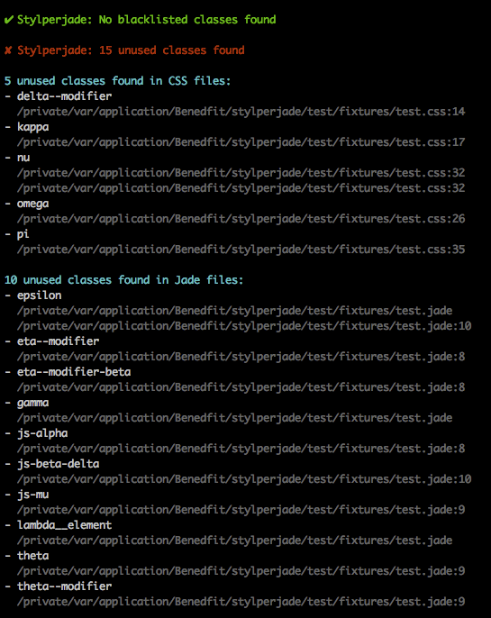

# Stylperjade

Pronounced: /[stʌɪl](//ssl.gstatic.com/dictionary/static/sounds/de/0/style.mp3) [pəˈreɪd](//ssl.gstatic.com/dictionary/static/sounds/de/0/parade.mp3)/ - Checks Jade against CSS, and vice versa, for unused classes.

[](https://travis-ci.org/benedfit/stylperjade)
[](https://www.npmjs.com/package/stylperjade)

## Installation

```shell
$ npm install stylperjade --save
```

## Usage

```js
var stylperjade = require('stylperjade')

  , cssFiles = [ 'index.css' ]
  , jadeFiles = [ 'default.jade', 'includes/header.jade' ]
  , options =
    { cssWhitelist: [ 'js', 'no-svg', 'icon--*', 'is-*' ]
    , jadeWhitelist: [ 'js-*', 'style-guide-nav' ]
    , cssBlacklist: [ 'js-*' ]
    , jadeBlacklist: []
    }

stylperjade(cssFiles, jadeFiles, options, function (err, results) {
  console.log(results.report)
})
```

### Configuration file

Alternatively options can be specified in a `.stylperjaderc` file. If no options have been specified, Stylperjade checks the current working directory to see if there is a `.stylperjaderc` file present. This can be overridden by setting `options.stylperjaderc` to the path of the desired configuration file:

```js
var options = { stylperjaderc: '/path/to/.stylperjaderc' }

stylperjade(cssFiles, jadeFiles, options, function (err, results) {
  console.log(results.report)
})
```

### Known issues

* [Line number are not reported for nested classes in .jade files](https://github.com/benedfit/stylperjade/issues/13)
* [Line number are not reported, or errors are thrown, for classes found in Jade \#\[\] syntax blocks](https://github.com/benedfit/stylperjade/issues/7)

## API

### stylperjade(cssFiles, jadeFiles, [options,] callback)

#### cssFiles

*Required*
Type: `Array`

An array of `.css` file paths.

#### jadeFiles

*Required*
Type: `Array`

An array of `.jade` file paths.

#### options

Type: `object`

| Name          | Type     | Description |
| ------------- | -------- | ----------- |
| cssBlacklist  | `Array`  | An array of patterns for classes that should never exist in `.css` files |
| cssWhitelist  | `Array`  | An array of patterns for classes to ignore when they exist in `.css` but not in `.jade` files |
| jadeBlacklist | `Array`  | An array of patterns for classes that should never exist in `.jade` files |
| jadeWhitelist | `Array`  | An array of patterns for classes to ignore when they exist in `.jade` but not in `.css` files |
| stylperjaderc | `string` | The alternative path to a `.stylperjaderc` file to load options from |

#### callback(error, results)

*Required*
Type: `function`

##### results

Type: `object`

| Name                                              | Type     | Description |
| ------------------------------------------------- | -------- | ----------- |
| [blacklistedCssClasses](#user-content-example-classes-object)  | `object` | The blacklisted classes found in `.css` files |
| blacklistedCssCount                               | `int`    | The number of blacklisted classes found in `.css` files |
| [blacklistedJadeClasses](#user-content-example-classes-object) | `object` | The blacklisted classes found in `.jade` files |
| blacklistedJadeCount                              | `int`    | The number of blacklisted classes found in `.jade` files |
| blacklistedTotal                                  | `int`    | The total number of blacklisted classes found in all files |
| [unusedCssClasses](#user-content-example-classes-object)       | `object` | The classes found that exist in `.css` but not `.jade` files |
| unusedCssCount                                    | `int`    | The number of classes found that exist in `.css` but not `.jade` files |
| [unusedJadeClasses](#user-content-example-classes-object)      | `object` | The classes found that exist in `.jade` but not `.css` files |
| unusedJadeCount                                   | `int`    | The number of classes found that exist in `.jade` but not `.css` files |
| unusedTotal                                       | `int`    | The total number of ununsed classes found in all files |
| [report](#user-content-example-report)                       | `string` | The visual representation of blacklisted and unused classes found across all files |

###### Example classes object

```json
{ "name": "style-guide-nav"
, "locations":
  [ { "file": "/path/to/.css/or/.jade", "line": 1, "column": 1 }
  , { "file": "/path/to/another/.css/or/.jade", "line": 5, "column": 3 }
  ]
}
```

###### Example report



## Licence
ISC © [Ben Edwards](https://github.com/benedfit/)
