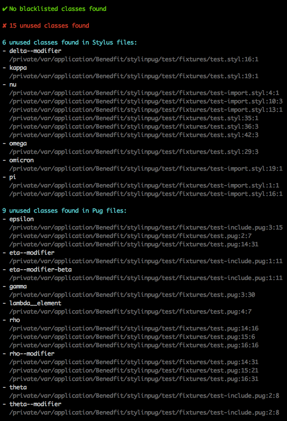

# Stylperjade

Pronounced: /[stʌɪl](//ssl.gstatic.com/dictionary/static/sounds/de/0/style.mp3) [pəˈreɪd](//ssl.gstatic.com/dictionary/static/sounds/de/0/parade.mp3)/ - Checks Jade against CSS, and vice versa, for unused and blacklisted classes.

> Now with CLI support for better testing!

[](https://travis-ci.org/benedfit/stylperjade)
[](https://www.npmjs.com/package/stylperjade)

## CLI

## Installation

```shell
$ npm install stylperjade -g
```

## Usage

```shell
$ stylperjade [options] <cssFiles...> <jadeFiles...>

```

OR to find all CSS and Jade files in current working directory

```
$ stylperjade [options] .
```

### options

* `-h, --help`: output usage information
* `-V, --version`: output the version number
* `-v, --verbose`: displays the full [visual representation](#user-content-example-report) of blacklisted and unused classes
* `-C, --chdir <path>`: change the working directory
* `-c, --config <path>`: set path to load options from. Defaults to [./.stylperjaderc](#user-content-configuration-file)

## API

### Installation

```shell
$ npm install stylperjade --save
```

### Usage

```js
var stylperjade = require('stylperjade')

  , cssFiles = [ 'index.css', '**/index*.css' ]
  , jadeFiles = [ 'default.jade', 'includes/header.jade' ]
  , options =
    { ignoreFiles: [ '**/footer.styl', '**/header.jade' ]
    , cssWhitelist: [ 'js', 'no-svg', 'icon--*', 'is-*' ]
    , jadeWhitelist: [ 'js-*', 'style-guide-nav' ]
    , cssBlacklist: [ 'js-*' ]
    , jadeBlacklist: []
    }

stylperjade(cssFiles, jadeFiles, options, function (err, results) {
  console.log(results.report)
})
```

### stylperjade(cssFiles, jadeFiles, [options,] callback)

#### cssFiles

*Required*
Type: `Array`

An array of `.css` file name patterns.

#### jadeFiles

*Required*
Type: `Array`

An array of `.jade` file name patterns.

#### options

Type: `object`

| Name | Type | Description |
| --- | --- | --- |
| cwd | `string` | The alternative path to the current working directory |
| verbose | `boolean` | Displays the full [visual representation](#user-content-example-report) of blacklisted and unused classes |
| ignoreFiles | `Array` | An array of patterns for file names to ignore when they exist in `.css` files, `.jade` files, or source map sources |
| cssBlacklist | `Array` | An array of patterns for classes that should never exist in `.css` files or source map sources |
| cssWhitelist | `Array` | An array patterns for classes to ignore when they exist in `.css` files or source maps sources but not in `.jade` files |
| jadeBlacklist | `Array` | An array of patterns for classes that should never exist in `.jade` files |
| jadeWhitelist | `Array` | An array of patterns for classes to ignore when they exist in `.jade` files but not in `.css` files or source map sources |
| stylperjaderc | `string` | The alternative path to a `.stylperjaderc` file to load options from |

#### callback(error, results)

*Required*
Type: `function`

##### results

Type: `object`

| Name | Type | Description |
| --- | --- | --- |
| [blacklistedCssClasses](#user-content-example-classes-object) | `object` | The blacklisted classes found in `.css` files |
| blacklistedCssCount | `int` | The number of blacklisted classes found in `.css` files |
| [blacklistedJadeClasses](#user-content-example-classes-object) | `object` | The blacklisted classes found in `.jade` files |
| blacklistedJadeCount | `int` | The number of blacklisted classes found in `.jade` files |
| blacklistedTotal | `int` | The total number of blacklisted classes found in all files |
| [unusedCssClasses](#user-content-example-classes-object) | `object` | The classes found that exist in `.css` but not `.jade` files |
| unusedCssCount | `int` | The number of classes found that exist in `.css` but not `.jade` files |
| [unusedJadeClasses](#user-content-example-classes-object) | `object` | The classes found that exist in `.jade` but not `.css` files |
| unusedJadeCount | `int` | The number of classes found that exist in `.jade` but not `.css` files |
| unusedTotal | `int` | The total number of ununsed classes found in all files |
| [report](#user-content-example-report) | `string` | The visual representation of blacklisted and unused classes found across all files |

###### Example classes object

```json
{ "name": "style-guide-nav"
, "locations":
  [ { "file": "/path/to/.css/or/.jade", "line": 1, "column": 1 }
  , { "file": "/path/to/another/.css/or/.jade", "line": 5, "column": 3 }
  , { "file": "/path/to/original/source/using/source/map", "line": 20 }
  ]
}
```

###### Example report



## Configuration file

Options can be specified in a `.stylperjaderc` file ([see example](.stylperjaderc)). If no options have been specified, Stylperjade checks the current working directory to see if there is a `.stylperjaderc` file present. This can be overridden by setting `options.stylperjaderc` to the path of the desired configuration file:

```js
var options = { stylperjaderc: '/path/to/.stylperjaderc' }

stylperjade(cssFiles, jadeFiles, options, function (err, results) {
  console.log(results.report)
})
```

## Directives

The following configuration directives as supported by Stylperjade:

### csswhitelist

Adds the specified pattern to [`options.cssWhitelist`](#options-1)

* CSS usage: `/!* stylperjade csswhitelist <pattern> */`
* Jade usage: `//- stylperjade csswhitelist <pattern>`

### jadewhitelist

Adds the specified pattern to [`options.jadeWhitelist`](#options-1)

* CSS usage: `/!* stylperjade jadewhitelist <pattern> */`
* Jade usage: `//- stylperjade jadewhitelist <pattern>`

### whitelist

Adds the specified pattern to both [`options.cssWhitelist`](#options-1) and [`options.jadeWhitelist`](#options-1)

* CSS usage: `/!* stylperjade whitelist <pattern> */`
* Jade usage: `//- stylperjade whitelist <pattern>`

### cssblacklist

Adds the specified pattern to [`options.cssBlacklist`](#options-1)

* CSS usage: `/!* stylperjade cssblacklist <pattern> */`
* Jade usage: `//- stylperjade cssblacklist <pattern>`

### jadeblacklist

Adds the specified pattern to [`options.jadeBlacklist`](#options-1)

* CSS usage: `/!* stylperjade jadeblacklist <pattern> */`
* Jade usage: `//- stylperjade jadeblacklist <pattern>`

### blacklist

Adds the specified pattern to both [`options.cssBlacklist`](#options-1) and [`options.jadeBlacklist`](#options-1)

* CSS usage: `/!* stylperjade blacklist <pattern> */`
* Jade usage: `//- stylperjade blacklist <pattern>`

## Licence
ISC © [Ben Edwards](https://github.com/benedfit/)
